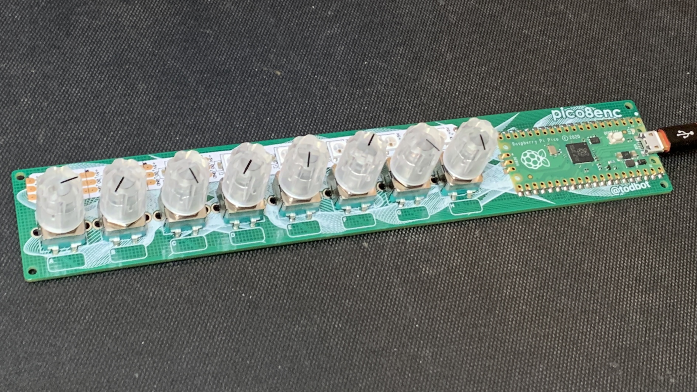

# pico8enc -- 8 rotary encoders on a Raspberry Pi Pico

Turns out you can hook up 8 rotary encoders w/ switches to
Raspberry Pi Pico with no extra hardware. Pretty cool!

With CircuitPython, it becomes pretty easy to actually read these encoders
since all hard, timing-critical work is done inside the C-based `rotaryio`
library that comes standard with CircuitPython.





One "twist" to look out for (haha): the two rotary encoder pins must be hooked up
to adjacent pins on the Pico, because of how `rotaryio` uses the Pico's
PIO module to handle reading the encoder pulses.

The core of the code looks like this:
```py
encoder_pins = ( (board.GP12, board.GP13, board.GP16),  # pin A, pin B, pin for switch
                 (board.GP10, board.GP11, board.GP17),
                 (board.GP8, board.GP9, board.GP18),
                 (board.GP6, board.GP7, board.GP19),
                 # ...
                 )
encoders = []
encoder_buttons = []
for pins in encoder_pins:
    pin_A, pin_B, pin_switch = pins
    encoder = rotaryio.IncrementalEncoder( pin_A, pin_B )
    button = DigitalInOut(pin_switch)
    button.pull = Pull.UP
    encoders.append(encoder)
    encoder_buttons.append(button)

while True:
    for i in range(len(encoders)):
      position = encoders[i].position
      button_press = encoder_buttons[i].value

```


